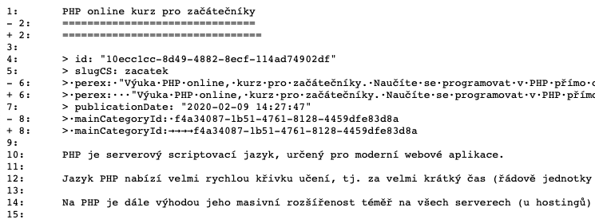
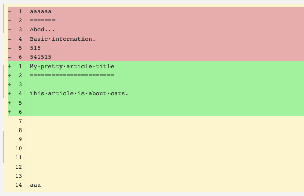

Simple PHP diff
===============

Find the quick difference between two text files in PHP.

Idea
----

The library compares two text files very quickly and returns the object with the differences.

The difference has numbered lines for easy display of changes to the user. You can also read an array of changed rows as an integer array from the `Diff` object as you browse for changes.

📦 Installation
---------------

It's best to use [Composer](https://getcomposer.org) for installation, and you can also find the package on
[Packagist](https://packagist.org/packages/baraja-core/simple-php-diff) and
[GitHub](https://github.com/baraja-core/simple-php-diff).

To install, simply use the command:

```
$ composer require baraja-core/simple-php-diff
```

You can use the package manually by creating an instance of the internal classes, or register a DIC extension to link the services directly to the Nette Framework.

Example
-------



Diff can be rendered to HTML (with native method `SimpleDiff::renderDiff($diff)`:



How to use
----------

Simply create a SimpleDiff instance and compare the two files:

```php
$left = 'First text';
$right = 'Second text';

$diff = (new \Baraja\DiffGenerator\SimpleDiff)->compare($left, $right);

// simple render diff
echo '<code><pre>'
     . htmlspecialchars((string) $diff)
     . '</pre></code>';
```

The `compare()` method returns a complete object `Diff` with the results of the comparison, from which you can get much more.

For example, to get a list of changed rows:

```php
echo 'Changed lines: ';
echo implode(', ', $diff->getChangedLines());
```

Display the Diff in HTML
------------------------

Very often we need to display the differences directly in the browser, for this the native method `renderDiff()` is suitable.

```php
$left = 'First text';
$right = 'Second text';

$simpleDiff = new \Baraja\DiffGenerator\SimpleDiff;
$diff = $simpleDiff->compare($left, $right);

echo $simpleDiff->renderDiff($diff);
```

The method accepts Diff and returns valid treated HTML that can be displayed directly to the user.

Comparison mode
---------------

This tool supports strict and basic comparison modes (strict mode is disabled by default).
Strict mode also allows you to compare changes in different line wrapping methods (for example, `"\n"` and so on).


📄 License
-----------

`baraja-core/simple-php-diff` is licensed under the MIT license. See the [LICENSE](https://github.com/baraja-core/template/blob/master/LICENSE) file for more details.
